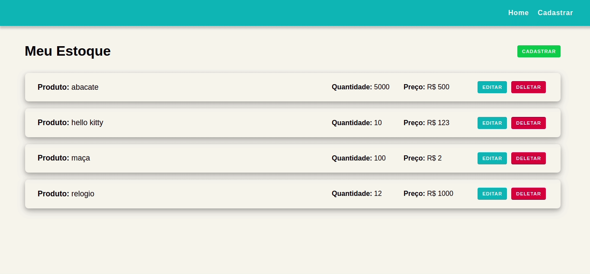

<h1 align="center">
    DTI Inventory Project
</h1>

<p align="center">
  <a href="https://www.linkedin.com/in/joaorpereira">
    
  </a>

  
  
   <a href="https://developer.mozilla.org/pt-BR/docs/Web/JavaScript">
    
  </a>
     <a href="https://reactjs.org/">
    
  </a>
  <a href="https://www.typescript.com/">
    
  </a>
  <a href="https://nodejs.org/en/">
    
  </a>
</p>

<p align="center">
 <a href="#about">About</a> • 
 <a href="#technologies">Technologies</a> • 
 <a href="#how-to-start-the-project">How to start the project</a> • 
 <a href="#backend">Backend</a> • 
 <a href="#mysql-database">MySQL database</a> • 
 <a href="#frontend">Frontend</a> •
 <a href="#license">License</a> • 
 <a href="#developer">Developer</a>
</p>

---
### About

The project **DTI Inventory** was made as a part of selection process and I used **React** and **Javascript** to develop frontend and **NodeJS** and **Typescript** to create backend. The database was made using **MySQL**.



---

### Technologies

- [React](https://reactjs.org/);
    * [axios](https://www.npmjs.com/package/axios);
    * [react-router-dom](https://www.npmjs.com/package/react-router-dom);
    * [react-toastify](https://www.npmjs.com/package/react-toastify);
    * [immer](https://www.npmjs.com/package/immer);
    * [styled-components](https://styled-components.com/);
- [Redux](https://redux.js.org/);
    * [redux-saga](https://redux-saga.js.org/);
    * [redux-devtools-extension](https://github.com/reduxjs/redux-devtools);

- [Typescript](https://www.typescriptlang.org);
- [Node.js](https://nodejs.org/en/);
    * [express](https://expressjs.com/);
    * [cors](https://www.npmjs.com/package/cors);
    * [dotenv](https://www.npmjs.com/package/dotenv);
    * [uuid](https://www.npmjs.com/package/uuid);
    * [knex](https://www.npmjs.com/package/knex);
- [Mysql](https://www.mysql.com)

---

### How to start the project

##### Clone repository:
```bash
$ git clone https://github.com/joaorpereira/dti_inventory.git
```
---

### Backend
```bash
$ cd dti_inventory
$ cd server
```
##### Install dependencies:
```bash
$ npm install
```
##### Create MySQL database:
```bash
$ create database as dti_backend at MySQL 
```
##### Create database connection:
```bash
  client: 'mysql',
  connection: {
    host: process.env.HOST,
    port: 3306,
    user: process.env.DB_NAME,
    password: process.env.DB_PASSWORD,
    database: process.env.DB_DATABASE,
  },
```
##### Create MySQL products table:
```bash
$ npm create-table
```
##### Start project:
```bash
$ npm run dev
```
##### The endpoints of this API are at the file Insomnia_file in this repository

---

### MySQL database

##### Products Table
```bash
    id VARCHAR(255) PRIMARY KEY,
    name VARCHAR(255) NOT NULL,
    quantity INT DEFAULT 0,                
    price FLOAT DEFAULT 0
```
---

### Frontend

```bash
$ cd dti_inventory
$ cd client
```
##### Install dependencies:
```bash
$ npm install
```
##### Create database connection:
```bash
   class DataBase {
    protected static connection = knex({
        client: 'mysql',
        connection: {
          host: proccess.env.HOST,
          port: 3306,
          user: proccess.env.DB_NAME,
          password: proccess.env.DB_PASSWORD,
          database: proccess.env.DB_DATABASE,
        }
    })
  }
```
---

### License

This project is under <a href="https://opensource.org/licenses/MIT">MIT</a> license

---

### Developer

<p align="center">
    <a href="https://github.com/joaorpereira">
        
        <br/>
        <sub><b>Joao Paulo</b></sub>
    </a>
</p>
<h6 align="center">
    Desenvolvido por Joao Paulo.
</h6>
<p align="center">
    <a href="https://www.linkedin.com/in/joaorpereira">
    
    </a>
    <a href="mailto:rpjoaopaulo28@gmail.com">
        
    </a>
</p>
